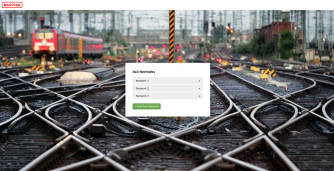
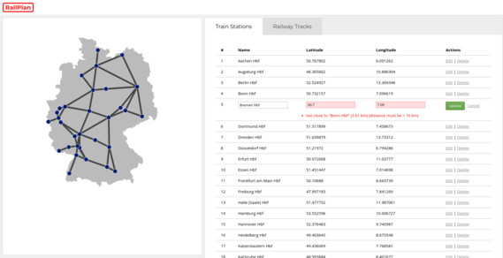

# RailPlan

RailPlan is a web application that let's you create simple Railway Networks within Germany. The Railway Network is
basically an undirected graph, composed of Train Stations as nodes and Railway Tracks as edges.

[](https://github.com/ralfhenze/railplan/actions?query=workflow%3A%22Build+%26+Test%22)
[](https://www.codacy.com/manual/ralfhenze/railplan?utm_source=github.com&utm_medium=referral&utm_content=ralfhenze/railplan&utm_campaign=Badge_Coverage)
[](https://www.codacy.com/manual/ralfhenze/railplan?utm_source=github.com&amp;utm_medium=referral&amp;utm_content=ralfhenze/railplan&amp;utm_campaign=Badge_Grade)
[](https://sonarcloud.io/dashboard?id=ralfhenze_railplan)
[](https://sonarcloud.io/dashboard?id=ralfhenze_railplan)
[](https://sonarcloud.io/dashboard?id=ralfhenze_railplan)





## Run

You need docker-compose installed on your system. This was only tested on Linux! Just run:

```console           
$ docker-compose up -d
```
This will spin up a MongoDB instance, compile the application code with Maven and run the application in it's own
container. When everything is up and running the UI should be accessible at <http://localhost:8080/>

You can stop and destroy the Docker containers by running:
 
```console           
$ docker-compose down
```

## Tests

```console
$ docker-compose up -d mongodb         # Start MongoDB container
$ mvn verify                           # Run all tests
$ mvn test                             # Run only unit and acceptance tests
$ docker-compose down                  # Destroy Docker containers
```

## Implementation Notes

### Architecture

*   the overall structure is like an [Onion Architecture](https://dzone.com/articles/onion-architecture-is-interesting)
    or [Clean Architecture](https://blog.cleancoder.com/uncle-bob/2012/08/13/the-clean-architecture.html) where we have
    four "onion" layers with dependencies pointing inward:
    *    [Domain](01-domain/src/main/java/com/ralfhenze/railplan/domain):
         technology agnostic domain objects to enforce domain invariants
    *    [Application](02-application/src/main/java/com/ralfhenze/railplan/application):
         technology agnostic application services, segregated into commands and queries
         (see [CQRS](https://cqrs.nu/Faq/command-query-responsibility-segregation))
    *    [Infrastructure](03-infrastructure/src/main/java/com/ralfhenze/railplan/infrastructure):
         MongoDB persistence
    *    [User Interface](04-userinterface/src/main/java/com/ralfhenze/railplan/userinterface):
         Spring MVC stuff (Controllers and HTML-Views)
*   I use the [Java Platform Module System](https://www.baeldung.com/java-9-modularity) (a.k.a. Jigsaw Modules) to
    have a clean separation of the layers and to enforce the direction of dependencies between them (for example the
    domain layer is not allowed to use any object of the other layers around it)

### Domain Core

*   all my domain objects are immutable, because:
    [Benefits of immutable objects](http://www.javapractices.com/topic/TopicAction.do?Id=29) 
*   I use [Eclipse Collections](https://www.eclipse.org/collections/) for Lists and Maps. This library has nothing to
    do with the Eclipse IDE! It has a very nice and powerful API, much better than the standard Java collections with
    streams. It needs less boilerplate (```list.collect(e -> e.toString()``` vs.
    ```list.stream().map(e -> e.toString()).collect(Collectors.toList())```) and I'm able to express and check
    immutability at compile-time: ```ImmutableList<T>``` vs. the standard Java ```List<T>``` + runtime exceptions on
    mutation.
*   The domain model won't ever get into an invalid state, because I validate everything at construction
    time and throw a ValidationException if any invariant is violated. This technique ensures that you won't ever get
    an instance of a domain object with invalid state.
*   probably the most important domain object is the
    [RailNetwork](01-domain/src/main/java/com/ralfhenze/railplan/domain/railnetwork/RailNetwork.java)
    aggregate

### User Interface

*   the UI is completely rendered on the server
*   no JavaScript is used to keep things simple for now
*   I orginally used [Thymeleaf](https://www.thymeleaf.org/) as a template engine, but
    [the templates](https://github.com/ralfhenze/railplan/tree/c3033e918bbd78033c602d05efe04ecf84969876/04-userinterface/src/main/resources/templates)
    where a PITA to maintain, so I switched to [j2html](https://j2html.com/), which I like a lot for it's type-safety
*   missing type-safety is also the reason why I stopped using Spring MVC's Model class
*   my current approach to HTML rendering is somewhat inspired by React, with composable and immutable View objects
    resembling React's functional components

### Tests

*   I use [JUnit](https://junit.org/) as my main testing framework
*   I use [AssertJ](https://joel-costigliola.github.io/assertj/) for assertions instead of JUnit's default ones or
    Hamcrest, because IMHO they are much easier to read and use
*   I use [Mockito](https://site.mockito.org/) for mocking
*   I use [Cucumber](https://cucumber.io/docs/installation/java/) for BDD-style acceptance testing with
    [feature files](01-domain/src/test/resources/com/ralfhenze/railplan/features)
    readable for non-tech-people. My original goal was to have all domain invariants covered by those feature files,
    but they are a lot less maintainable than simple unit tests. So I kept a few Cucumber
    [step definitions](01-domain/src/test/java/com/ralfhenze/railplan/acceptance/stepdefs) just to show, that I'm
    capable of writing these kind of tests. The rest is covered by simple
    [unit tests](01-domain/src/test/java/com/ralfhenze/railplan/domain).
*   I use [JSoup](https://jsoup.org/) for HTML parsing in
    [UI integration tests](04-userinterface/src/test/java/com/ralfhenze/railplan/userinterface/web). This gives me a
    very convenient, jQuery-like API to make assertions against specific HTML elements.
*   I intentionally decided to not use Spring MockMvc's assertion API (```mockMvc.perform(...).andExpect(...)```),
    because it expects Hamcrest assertions and I wanted to be consistent with AssertJ. They make the tests easier to
    maintain and read.
*   I use [Selenium](https://selenium.dev/) with ChromeDriver for end-to-end tests
*   I use test class suffixes for better distinction: UT = Unit Tests, IT = Integration Tests, ET = End-to-End Tests

### Quality Assurance

*   I use [GitHub Actions](https://github.com/ralfhenze/railplan/actions) for continuous integration, to automatically
    run the tests on each push
*   I use [SonarCloud](https://sonarcloud.io/dashboard?id=ralfhenze_railplan) and
    [Codacy](https://app.codacy.com/manual/ralfhenze/railplan/dashboard) for static code analysis and quality reports
*   I try to adhere to the [Clean Code principles](https://clean-code-developer.com/) as good as possible

### Coding Conventions

*   I use Java's new local type inference (```var```) wherever possible, to make the code easier to read
*   I use the ```final``` keyword wherever I can, to enforce immutability of local variables, class fields and method
    parameters. I know
    [this is](https://softwareengineering.stackexchange.com/questions/98691/excessive-use-final-keyword-in-java)
    [debatable](https://stackoverflow.com/questions/137868/using-the-final-modifier-whenever-applicable-in-java)
    but in this case I favor compile-time strictness over readability

## Domain Model

### Ubiquitous Language Glossary

| Term                      | Acceptable Synonym | Description                                                                                                                                                                                                                 |
|---------------------------|--------------------|-----------------------------------------------------------------------------------------------------------------------------------------------------------------------------------------------------------------------------|
| **Train Station**         | _Station_          | Building where trains regularly stop to load or unload passengers, [more info](https://en.wikipedia.org/wiki/Train_station)                                                                                                 |
| **Railway Track**         | _Track_            | Straight [double track railway](https://en.wikipedia.org/wiki/Double-track_railway) connection between two train stations, [more info](https://en.wikipedia.org/wiki/Track_%28rail_transport%29)                            |
| **Rail Network**          | _Network_          | Undirected graph with Train Stations as nodes and Railway Tracks as edges                                                                                                                                                   |
| **Geo Location**          | _Location_         | [Geographic coordinates](https://en.wikipedia.org/wiki/Geographic_coordinate_system) within Germany, defined by [Latitude](https://en.wikipedia.org/wiki/Latitude) and [Longitude](https://en.wikipedia.org/wiki/Longitude) |

### Simplifying Assumptions

As this is a one-man project and my goal is not to model the real-world with all its complexities, I will make some simplifying assumptions:

*   the Rail Network is just within Germany
*   a Track between two Stations is a straight line, no curves, no altitude differences
*   a Track between two Stations is actually a double track railway, one for each direction, no passing loops

### Invariants

Train Station:

*   a Station is located within Germany's bounding rectangle
*   a Station's Name begins with an uppercase letter
*   a Station's Name is allowed to contain \[a-zA-ZäöüßÄÖÜ .-()\]
*   a Station's Name is unique within the Rail Network
*   the minimum distance between two Stations is 10 km

Railway Track:

*   a Track connects two different Stations
*   two Stations can only be connected by a single Track
*   the maximum length of a Track is 300 km

## Author

*   Ralf Henze
